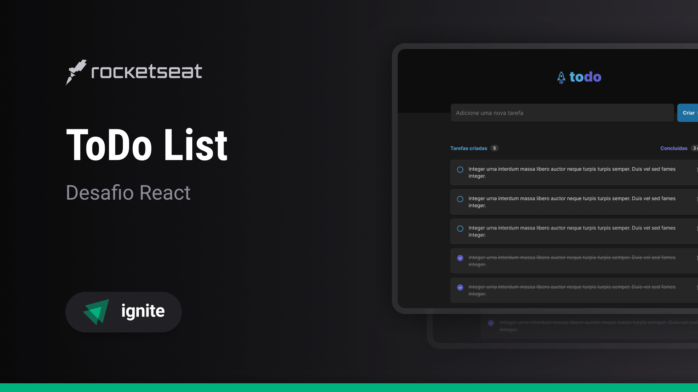

Aplicação desenvolvida como desafio da trilha Ignite da [RockeatSeat](https://rocketseat.com.br/?utm_source=aluno&utm_medium=germano-ricardi&utm_campaign=dev_fullstack).



## Descrição  

A aplicação é um controle de tarefas no estilo **to-do list**, que contém as seguintes funcionalidades:
*   Adicionar uma nova tarefa;
*   Marcar e desmarcar uma tarefa como concluída;
*   Remover uma tarefa da listagem;
*   Mostrar o progresso de conclusão das tarefas;

Apesar de serem poucas as funcionalidades, foram aplicados conceitos como:
*   Estados;
*   Imutabilidade do estado;
*   Listas e chaves no React Native;
*   Propriedades;
*   Componentização;

## Tecnologias utilizadas

* [x] [NodeJS](https://nodejs.org/en/)
* [x] [React](https://reactjs.org/)
* [x] [Vite](https://vitejs.dev/)
* [x] [TypeScript](https://www.typescriptlang.org/)
* [x] [UUID (V4)](https://www.npmjs.com/package/uuidv4)
* [x] [Phosphor Icons](https://phosphoricons.com/)  

## Quickstart
Clone o repositório:
```sh
$  git clone https://github.com/germanoricardi/desafios-rocketseat-todo-list.git
```
Para executar a aplicação Vite:
```sh
$  npm install
$  npm run dev
```